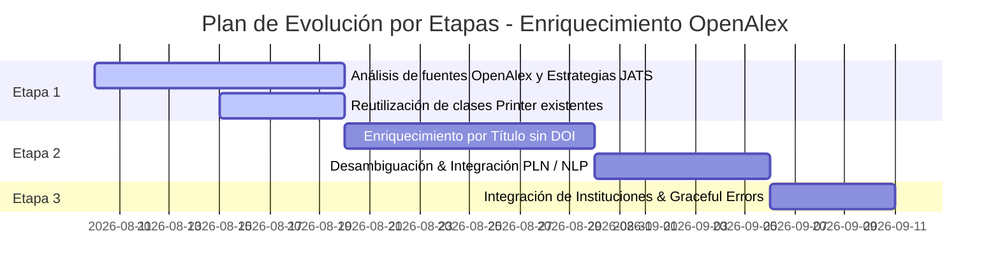

# Ticket Redmine: Refactorización y Ampliación del Módulo de Enriquecimiento Bibliográfico mediante OpenAlex API (Factory & Strategy)

## Informes y Metadatos del Ticket

| Campo | Valor |
| :--- | :--- |
| **Proyecto** | OJS Plugin `docxConverter` / `citation-parser-ojs` |
| **Tracker / Tipo** | Feature / Refactorización de Arquitectura |
| **Título** | Reestructuración del Enriquecimiento OpenAlex (Factory & Strategy) y Plan de Evolución por Etapas |
| **Prioridad** | Alta |
| **Estado** | Nueva |
| **Categoría** | Enriquecimiento OpenAlex / Exportación XML JATS |
| **Asignado a** | Equipo de Desarrollo SEDICI |

---

## 1. Contexto y Descripción de la Necesidad

### 1.1. Estado Anterior (Solución Legacy)
En la versión inicial del parser de citas bibliográficas (`citation-parser-ojs`), la integración con la API de OpenAlex y la posterior inyección de metadatos en el XML JATS se encontraba acoplada en un esquema rígido y monolítico.

**Principales limitaciones identificadas:**
* **Baja Extensibilidad:** Enfocado casi exclusivamente en artículos de revistas (*journals*), complicando la adición de otros tipos de publicaciones (libros, capítulos, conferencias, tesis).
* **Código Duplicado (*Duplicate Code Smell*):** Múltiples secciones del código repetían la construcción manual de nodos XML JATS comunes (autores, fechas, títulos, identificadores DOI).
* **Falta de Fallback Graceful:** Falta de una estrategia genérica clara cuando la API de OpenAlex devolvía fuentes no catalogadas o no mapeables directamente.

### 1.2. Solución Diseñada e Implementada (Patrones de Diseño)
Para otorgar flexibilidad, mantenibilidad y adherencia a los principios **SOLID**, se rediseñó la arquitectura utilizando dos patrones de diseño estructurales y de comportamiento:

#### A. Patrón Factory (`OpenAlexEnricherFactory`)
* **Responsabilidad:** Encargada de resolver dinámicamente la estrategia de enriquecimiento adecuada inspeccionando la respuesta JSON de OpenAlex (`primary_location.source.type` o `type`).
* **Soporte de Registro Dinámico:** Cuenta con un método `registerEnricher(sourceType, enricherClass)` que permite registrar nuevas estrategias en tiempo de ejecución sin modificar la fábrica (cumpliendo el principio *Open/Closed*).
* **Mapeo Inteligente de Fuentes Equivalentes:** Mapea automáticamente tipos de fuente digitales o variantes secundarias devueltas por OpenAlex (por ejemplo, `"e-book digital"` o `"monograph"`) a estrategias consolidadas como `"book"`.

#### B. Patrón Strategy (`OpenAlexEnricherInterface`, `BaseOpenAlexEnricher`, `JournalOpenAlexEnricher`, `GenericOpenAlexEnricher`)
* **`OpenAlexEnricherInterface`:** Declara la interfaz común `enrich(DOMDocument $dom, array $data): array`.
* **`BaseOpenAlexEnricher` (Clase Abstracta Base):** Encapsula toda la lógica y formateo de elementos XML comunes a cualquier recurso bibliográfico (autores `<person-group>`, fecha `<year>/<month>/<day>`, título `<article-title>`, fuente `<source>`, DOI `<pub-id pub-id-type="doi">`, y enlaces externos `<ext-link>`). **Elimina el bad smell de código duplicado.**
* **Estrategias Concretas por Tipo de Fuente:** Se plantea definir una clase de estrategia concreta por cada tipo de referencia disponible en **Texture / XML JATS** (ej. `JournalOpenAlexEnricher`, `BookOpenAlexEnricher`, `ChapterOpenAlexEnricher`, `ConfprocOpenAlexEnricher`, `ThesisOpenAlexEnricher`), **siempre y cuando OpenAlex cuente con un tipo de fuente compatible.** Si en Texture existe un tipo de referencia (ej. *Magazine*) pero OpenAlex no lo especifica ni categoriza como fuente diferenciada, no se implementa una clase propia y el sistema delega automáticamente en la estrategia base/genérica.
* **`GenericOpenAlexEnricher` (Fallback Automático):** Sirve como la estrategia genérica de respaldo. Cuando OpenAlex retorna un recurso cuyo tipo de fuente no tiene una estrategia registrada, el Factory instancia `GenericOpenAlexEnricher`, asegurando que la cita se enriquezca con los datos comunes sin interrumpir el flujo.

---

## 2. Justificación Técnica y Mapeo de Fuentes (OpenAlex $\rightarrow$ Texture / XML JATS)

```mermaid
flowchart TD
    A[JSON API OpenAlex] --> B[OpenAlexEnricherFactory::resolve]
    B --> C{¿Existe fuente en $map?}
    C -- Sí (ej: 'journal') --> D[Instancia JournalOpenAlexEnricher]
    C -- Fuente Equivalente (ej: 'e-book digital') --> E[Mapea a 'book' -> BookOpenAlexEnricher]
    C -- No / Desconocido --> F[Instancia GenericOpenAlexEnricher (Fallback)]
    D --> G[Generación DOM XML JATS]
    E --> G
    F --> G
```

### 2.1. Justificación de los Patrones
1. **Desacoplamiento:** Separa la consulta de la API de OpenAlex de la representación física en el estándar XML JATS.
2. **Reutilización:** `BaseOpenAlexEnricher` centraliza el tratamiento de autores y fechas, previniendo incoherencias y duplicaciones.
3. **Escalabilidad:** Añadir soporte para una nueva fuente de OpenAlex solo requiere crear una nueva subclase de `BaseOpenAlexEnricher` y registrarla en el Factory.

---

## 3. Plan de Desarrollo por Etapas

El desarrollo y evolución del módulo de enriquecimiento OpenAlex se dividirá en 3 etapas sucesivas:



### **Etapa 1: Análisis de Fuentes OpenAlex, Cobertura de Estrategias y Reutilización de Printers**
* **Estudio y Mapeo de Fuentes:** Investigar las estructuras de datos JSON devueltas por la API de OpenAlex para cada tipo de trabajo (`journal`, `book`, `book-chapter`, `conference`, `thesis`, `repository`).
* **Mapeos de Equivalencias en Factory:** Identificar e integrar mapeos de equivalencia (ej: `"e-book digital"` o `"monograph"` $\rightarrow$ `"book"`).
* **Reutilización de la Jerarquía de Printers JATS:**
  * Actualmente, `BaseOpenAlexEnricher` implementa métodos helper auxiliares (`createElement`, `createAuthorsElement`, `createDoiElement`).
  * **Analizar y Refactorizar:** Evaluar la integración de las clases `Printer` existentes (`AuthorPrinter`, `BookPrinter`, `ChapterPrinter`, `ConfprocPrinter`, `DOIPrinter`, `DatePrinter`, `JournalPrinter`, `ThesisPrinter`, etc.) dentro de las estrategias de OpenAlex para reutilizar la lógica de renderizado JATS y evitar la duplicación de código entre el parser por expresiones regulares y el módulo de enriquecimiento API.
* **Casos de Prueba:** Expandir la suite de pruebas (basada en `tests/OpenAlex/test_intensivo.php`) validando la correcta generación de elementos JATS específicos (`<volume>`, `<issue>`, `<fpage>`, `<lpage>`, `<elocation-id>`, `<issn>`, `<publisher-name>`) según cada fuente.

### **Etapa 2: Enriquecimiento Inteligente sin DOI (Búsqueda por Título & PLN/NLP)**
* **Desafío:** Muchas referencias en texto plano carecen de DOI registrado en la cita o en OpenAlex.
* **Búsqueda por Título en OpenAlex:** Implementar la consulta a la API de OpenAlex utilizando el endpoint de búsqueda libre de títulos (`api.openalex.org/works?search=<titulo>`).
* **Algoritmo de Desambiguación (Múltiples Resultados):**
  * Cuando OpenAlex devuelva más de un resultado candidato para un título:
    1. Comparar los autores extraídos por Regex en la cita con los nombres/apellidos en `authorships` del JSON.
    2. Comparar el año de publicación (`publication_year`) y volumen/revista.
    3. Ponderar las coincidencias y seleccionar únicamente el recurso con mayor score de confianza.
* **Exploración de PLN / NLP:** Investigar y evaluar técnicas de Procesamiento de Lenguaje Natural (PLN/NLP) como alternativa o complemento a las Expresiones Regulares (Regex) actuales para la extracción inicial de metadatos en texto plano.
* **Evaluación Experimental:** Realizar pruebas de rendimiento y tasa de éxito con `test_intensivo.php`, cuantificando cuántas citas "Sin DOI" logran ser enriquecidas correctamente mediante la búsqueda por título.

### **Etapa 3: Integración de Instituciones Autoras y Manejo Tolerante a Fallos (*Graceful Degradation*)**
* **Análisis del Módulo de Instituciones:** Revisar las peticiones a la API de instituciones (`/institutions` y `authorships.institutions`).
* **Ajuste en el Manejo de Errores:**
  * **Problema:** Si una institución detectada en la cita no existe en la base de datos de OpenAlex, el sistema **NO debe lanzar un error ni cancelar la conversión**. Existen instituciones reales y válidas que no están registradas en OpenAlex.
  * **Solución:** Implementar *graceful degradation*. Si la validación de la institución falla o no retorna resultados, registrar una advertencia en los logs/reportes y continuar con el enriquecimiento de los demás metadatos de la cita (autores, título, revista, fecha, DOI).

---

## 4. Criterios de Aceptación del Ticket

1. [ ] **Estructura Factory & Strategy:** Todas las clases de enriquecimiento heredan de `BaseOpenAlexEnricher` e implementan `OpenAlexEnricherInterface`.
2. [ ] **Cobertura de Fuentes:** Definición de estrategias para los tipos de fuente en Texture soportados por OpenAlex, con fallback funcional a `GenericOpenAlexEnricher`.
3. [ ] **Reutilización de Printers:** Análisis y refactorización realizada para reaprovechar los `Printers` JATS de la librería en las estrategias.
4. [ ] **Búsqueda sin DOI:** Endpoint de búsqueda por título integrado con algoritmo de desambiguación de autores y año.
5. [ ] **Manejo de Errores en Instituciones:** La ausencia de una institución en OpenAlex no bloquea la generación del XML JATS.
6. [ ] **Suite de Tests:** Ejecución sin errores de `tests/OpenAlex/test_intensivo.php` generando el XML JATS y el reporte CSV comparativo.
